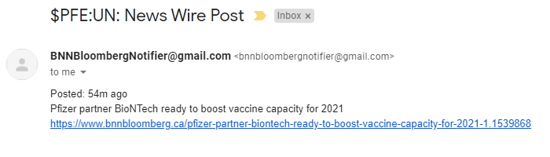

# BNN Bloomberg News Notifier

## Functionality
Sends an email notification when news is added to the BNN Bloomberg website for a custom stock watchlist. Stocks can be added and removed from the notification watchlist. All notifications contain the following details:
- Stock symbol
- Article Category
- Article post date
- Article title
- Article URL

## Notification Example

Provided for stock PFE:UN (PFIZER INC)

## Supporting Libraries

- beautifulsoup4
  - Facilitates web scraping
- pandas
  - Facilitates reading and writing scraped data from dataframe to csv
- yagmail
  - Facilitates sending of emails via Gmail
